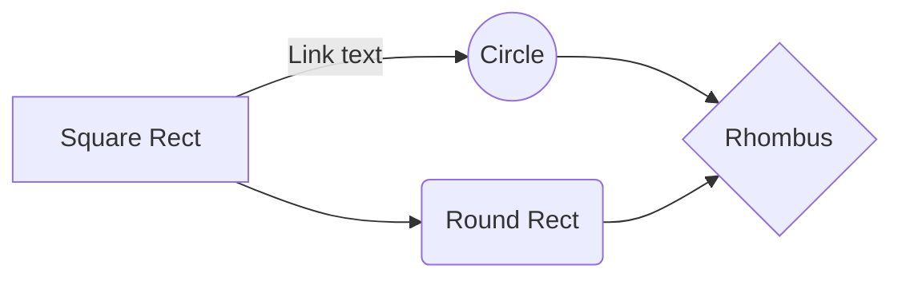

# KDD_DDOS

The Distributed Denial of Service (**DDoS**) attack aims to **exhaust** the computational resources
of a target host (in a computer network) in order to make a service **unavailable**.

The goal of the project "**Synthesis of a KDD Pipeline for DDoS Connections Data Classification**" (**KDD_DDOS**) is to create a KDD (Knowledge Discovery in Databases) pipeline based on supervised **machine learning** algorithm (shallow learning) in order to **classify connections** in the different classes of DDoS attacks. This  algorithm is the **Decision Tree**. The use of this algorithm is motivated by its widespread use in **Technology Transfer** contexts.

The chosen [**dataset**](https://www.unb.ca/cic/datasets/ddos-2019.html) derives from a simplification of the one proposed by the **Canadian Institute
for Cybersecurity**.

## Steps of Pipeline

The steps of pipeline are:
1. 
2. Data Exploration: This step is useful to understand 
3. Feature Evaluation:
4. 

And this will produce a flow chart:




The programming language used is Python (version 3.9.13). The dipendencies are illustrated in "requirements.txt" file.

## Repository Structure
```
|-LICENSE.md
|-README.md
|-/Boxplot/
|--this folder contains the boxplot for each feature
|-/dataset/
|--this folder contains the training and testing dataset
|-/doc/
|--this folder contains some slides that illustrates the results returned
|-function.py
|--This file ".py" contains the implementation of all useful functions 
|-main.py
|--This file ".py" contains the main function

```

## How to use
In order to use this project and run the source code, it is possible to:
* Install the required framework (using the "requirements.txt" file) via the command '$ pip3 install requirements.txt'
* Run the main function via the command 'python3 main.py'


## Credits

This project was developed as case of study during the course "Data Analysis for Security" (Master's Degree in Cybersecurity) under the supervision of Prof. Appice Annalisa in [Department of Computer Science](https://www.uniba.it/it/ricerca/dipartimenti/informatica/en) @[Università degli Studi di Bari Aldo Moro](https://www.uniba.it/en). 

This repository was created and maintained by Samuele del Vescovo, MSc in Cybersecurity.


# KDD_DDOS