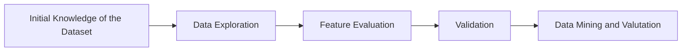

# KDD_DDOS

The Distributed Denial of Service (**DDoS**) attack aims to **exhaust** the computational resources
of a target host (in a computer network) in order to make a service **unavailable**.

The goal of the project "**Synthesis of a KDD Pipeline for DDoS Connections Data Classification**" (**KDD_DDOS**) is to create a KDD (Knowledge Discovery in Databases) pipeline based on supervised **machine learning** algorithm (shallow learning) in order to **classify connections** in the different classes of DDoS attacks. The algorithm used is the **Decision Tree**. The use of this algorithm is motivated by its widespread use in **Technology Transfer** contexts.

The chosen [**dataset**](https://www.unb.ca/cic/datasets/ddos-2019.html) derives from a simplification of the one proposed by the **Canadian Institute for Cybersecurity**.

## Steps of Pipeline

The steps of pipeline are:
1. **Initial Knowledge of the Dataset**:  this step is useful to understand the dataset cardinality and the examples distribution in the various classes.
2. **Data Exploration**: this step is useful to understand some key indicators of feature probability distribution. Futhermore, through the use of boxplots it is possible to understand the most prominent features i.e. the most labels discriminating features.
3. **Feature Evaluation**: this step is useful to understand the "importance" of the single feature through ranking algorithm like Mutual Info and Info Gain (based on the entropy related to the features). Futhrmore, it is used the PCA (Principal Component Analysis) to obtain the dataset projected along the principal component (naturally sorted).
4. **Validation**: this step is useful to understand the best parameter configuration related to the learned "pattern" of Decision Tree (for each feature ranking).
5. **Data Mining and Valutation**: this step is useful to understand the best learned pattern based on the best ranking.




The programming language used is Python (version 3.9.13). The dipendencies are illustrated in "requirements.txt" file.

## Repository Structure
```
|-LICENSE.md
|-README.md
|-/Boxplot/
|--this folder contains the boxplot for each feature
|-/dataset/
|--this folder contains the training and testing dataset
|-/doc/
|--this folder contains some slides that illustrates the results returned
|-function.py
|--This file ".py" contains the implementation of all useful functions 
|-main.py
|--This file ".py" contains the main function

```

## How to use
In order to use this project and run the source code, it is possible to:
* Install the required framework (using the "requirements.txt" file) via the command '$ pip3 install requirements.txt';
* Run the main function via the command 'python3 main.py'.


## Credits

This project was developed as case of study during the course "Data Analysis for Security" (Master's Degree in Cybersecurity) under the supervision of Prof. [Appice Annalisa](https://kdde.di.uniba.it/people/annalisa-appice/) in [Department of Computer Science](https://www.uniba.it/it/ricerca/dipartimenti/informatica/en) @[Università degli Studi di Bari Aldo Moro](https://www.uniba.it/en). 

This repository was created and maintained by Samuele del Vescovo, MSc in Cybersecurity.


